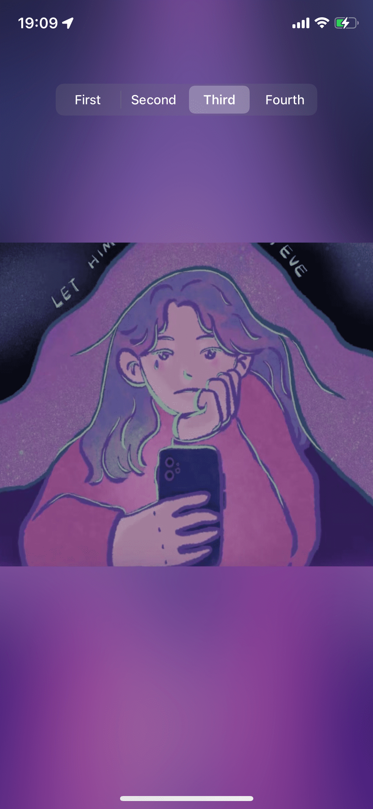

* 实现汽水音乐背景模糊效果

* 中间图片的上下边缘和模糊背景进行过渡,不会搞
```metal
fragment float4
fragment_blur_blend(RasterizerData input [[stage_in]],
                    constant KKUniform &uniforms [[buffer(KKVertexInputIndexUniforms)]],
                    texture2d<float, access::sample> texture0 [[texture(KKFragmentTextureIndexOne)]],
                    texture2d<float, access::sample> texture1 [[texture(KKFragmentTextureIndexTow)]]) {
    constexpr sampler textureSampler(mag_filter::linear, min_filter::linear);
    constexpr float3 luminanceWeighting = float3(0.2125, 0.7154, 0.0721);

    float2 uv = input.textureCoordinate;
    float4 color1 = texture0.sample(textureSampler, uv);
    float luminance = dot(color1.rgb, luminanceWeighting);
    float3 greyScaleColor = float3(luminance);

    float4 result = float4(mix(greyScaleColor, color1.rgb, uniforms.saturation), color1.w);

    //    result = color1;

    //    float4 dominantColor = float4(uniforms.dominantColor, 1.0);
    //    result = float4(mix(result.rgb, dominantColor.rgb, 1.0 - result.a), 1.0);

    float topMaxY = uniforms.top;
    float bottomMaxY = 1.0 - uniforms.bottom;

    if (uv.y >= topMaxY && uv.y < bottomMaxY) {

        float len = 1.0 - uniforms.top - uniforms.bottom;

        float2 uv2 = uv;
        uv2.y = (uv2.y - uniforms.top) / len;

        float4 color2 = texture1.sample(textureSampler, uv2);
        result = color2;
        // 上下边缘进行混合?
        //        if ((1.0 - uv.y) < topMaxY + uniforms.lenght) {
        //            float sFactor = ((uv.y - uniforms.top) / uniforms.lenght);
        //                        float dFactor = 1.0 - sFactor;
        //            //            result = result * sFactor + color2 * dFactor;
        //            //                        result = float4(mix(result.rgb, color2.rgb, sFactor), 1.0);
        ////            result = mix(result, color2, sFactor);
        //        } else if (uv.y > bottomMaxY && uv.y < bottomMaxY + uniforms.lenght) {
        //            float sFactor = ((uv.y - bottomMaxY) / uniforms.lenght);
        //            //                    float dFactor = 1.0 - sFactor;
        //            //                    result = color1 * sFactor + color2 * dFactor;
        //            //                    result = float4(mix(color2, result, sFactor), 1.0);
        //        }
    }

    return result;
}

```

