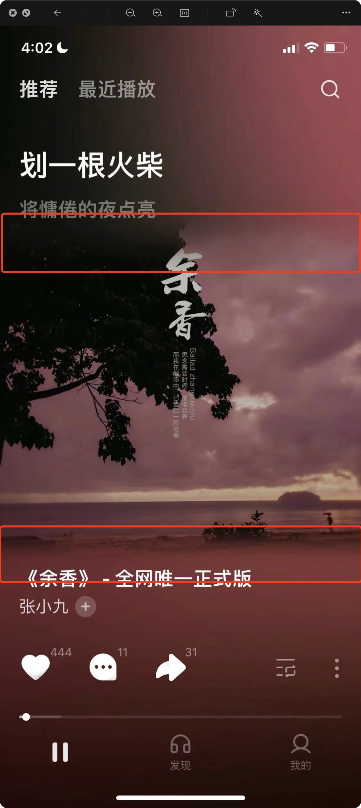

* 想要实现`汽水音乐`的背景模糊效果,通过越狱环境砸壳分析视图层级确定背景的模糊已经中间的图片都市融合到一张图片

* 通过`procreate`画图分析,可以复现的模式
  * 将中间图片铺满做`高斯模糊`
  * `高斯模糊`的结果进行饱和度调整
  * 将清晰图片混合到中间区域
  * 中间图片上下边界和后面模糊做混合
```metal
fragment float4
fragment_blur_blend(RasterizerData input [[stage_in]],
                    constant KKUniform &uniforms [[buffer(KKVertexInputIndexUniforms)]],
                    texture2d<float, access::sample> texture0 [[texture(KKFragmentTextureIndexOne)]],
                    texture2d<float, access::sample> texture1 [[texture(KKFragmentTextureIndexTow)]]) {
    constexpr sampler textureSampler(mag_filter::linear, min_filter::linear);
    constexpr float3 luminanceWeighting = float3(0.2125, 0.7154, 0.0721);

    float2 uv = input.textureCoordinate;
    float4 color1 = texture0.sample(textureSampler, uv);
    float luminance = dot(color1.rgb, luminanceWeighting);
    float3 greyScaleColor = float3(luminance);

    float4 saturation = float4(mix(greyScaleColor, color1.rgb, uniforms.saturation), color1.w);

    //    saturation = color1;

    //        float4 dominantColor = float4(uniforms.dominantColor, 1.0);
    //    saturation = float4(mix(saturation.rgb, dominantColor.rgb, 1.0 - saturation.a), 1.0);

    float4 finalColor = saturation;

    float topMaxY = uniforms.top;
    float bottomMaxY = 1.0 - uniforms.bottom;

    if (uv.y >= topMaxY && uv.y < bottomMaxY) {

        float len = 1.0 - uniforms.top - uniforms.bottom;

        float2 uv2 = uv;
        uv2.y = (uv2.y - uniforms.top) / len;

        float4 color2 = texture1.sample(textureSampler, uv2);

        // 上下边界进行混合?
        if ((1.0 - uv.y) < topMaxY + uniforms.lenght) {
            float sFactor = 1.0 - ((1.0 - uv.y - uniforms.top) / uniforms.lenght);
            float dFactor = 1.0 - sFactor;
            finalColor = saturation * sFactor + color2 * dFactor;
        } else if (uv.y >= (topMaxY) && uv.y < (topMaxY) + uniforms.lenght) {
            float p = uv.y - topMaxY;

            float sFactor = 1.0 - p / uniforms.lenght;
            float dFactor = 1.0 - sFactor;
            finalColor = saturation * sFactor + color2 * dFactor;
        } else {
            finalColor = color2;
        }
    }

    return finalColor;
}
```
* 完成效果

